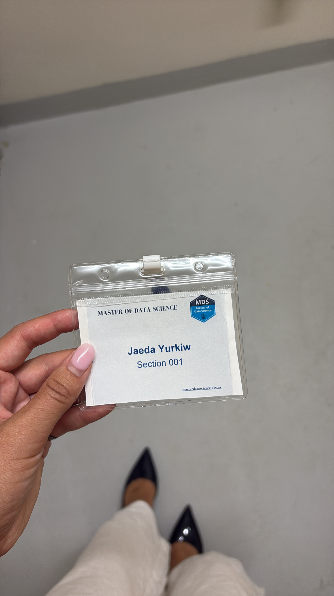

My first few weeks in the MDS have been exciting, rewarding, and definitely challenging! I knew the program would be fast-paced, but experiencing it firsthand has been an adjustment. Orientation week was a great way to begin the program. I really enjoyed getting to know my classmates and learning more about what to expect from the year ahead. 

The first few weeks of classes have been both overwhelming and challenging. Since I don’t come from a coding background, there has been a lot of new material to learn, and I’ve had to put in extra time and effort to build a strong foundation. Although it has been challenging, it has also been rewarding to see my progress. I’m learning something new every day, and I’m excited to continue building my technical skills throughout the program. 

One of the things that has surprised me most about the MDS has been how supportive and encouraging the professors and program team are. Compared with my undergraduate experience, where I sometimes felt more on my own, the MDS community has made it clear that they genuinely want students to succeed and are there to support us along the way. I’m grateful to be part of the MDS program and excited to continue developing my skills, learning from my classmates and professors, and seeing where this experience takes me.

